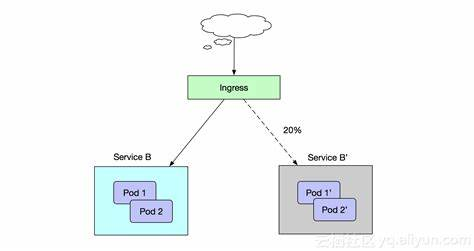

# Ingress

## 一、相关概念

Service对集群之外暴露端口主要方式有两种：`NodePort`和`LoadBalancer`，但是这两种方式，都有一个缺点

- `NodePort`方式的缺点是会占用很多集群的端口，集群服务器变多的时候，这个缺点愈发明显
- `LoadBalancer`的缺点是每个Service需要一个`LoadBalancer`，浪费、麻烦，并且需要k8s之外的设备支持

基于这两种现状，k8s提供了Ingress资源对象，Ingress值需要一个NodePort或者一个LoadBalancer就可以满足暴露多个Service的需求。工作机制大致如下图所示



实际上，Ingress相当于是一个7层的负载均衡器，是k8s对反向代理的一个抽象概念，它的工作原理类似于Nginx，可以理解成在Ingress里建立诸多反射规则，Ingress Controller通过监听这些配置规则转化成Nginx的反向代理配置，然后对外部提供服务。在这里有两个核心概念

- `Ingress`: k8s中的一个抽象概念，作用是定义请求转发到Service的规则
- `Ingress controller`: 具体实现反向代理及负载均衡的程序，对Ingress定义的规则进行解析，根据配置规则来实现转发，实现方式有很多种，比如Nginx、Controller、Haproxy等等。

Ingress（以Nginx为例）的工作原理如下

- 1. 用户编写Ingress规则，说明哪个域名对应k8s集群的哪个Seivice
- 2. Ingress控制器动态感知Ingress服务规则的变化，然后生成一段对应的Nginx反向代理配置
- 3. Ingress控制器将会生成的Nginx配置写入到一个运行着的Nginx服务中，并且动态更新
- 4. 其实真正在工作的就是一个Nginx了，内部配置了用户的请求转发规则

## 二、创建Ingress

### 2.1 创建Ingress Controller

将以下两个资源清单文件保存到服务器

```bash
# 创建目录
mkdir ingress-controller
# 进入资源目录
cd ingress-controller
# mandatory
wget https://github.com/kubernetes/ingress-nginx/blob/nginx-0.30.0/deploy/static/mandatory.yaml
# service-nodeport文件
wget https://raw.githubusercontent.com/kubernetes/ingress-nginx/nginx-0.30.0/deploy/static/provider/baremetal/service-nodeport.yaml
```

执行kubectl创建资源命令

```bash
kubectl apply -f ./
```

### 2.2 查看Ingress Controller

查看Pod：`kubectl get pods -n ingress-nginx`，返回以下内容

```bash
NAME                                        READY   STATUS    RESTARTS   AGE
nginx-ingress-controller-5bb8fb4bb6-qnbdv   1/1     Running   0          3m23s
```

查看Service：`kubectl get svc -n ingress-nginx`，返回以下内容

```bash
NAME            TYPE       CLUSTER-IP      EXTERNAL-IP   PORT(S)                      AGE
ingress-nginx   NodePort   10.99.166.208   <none>        80:30796/TCP,443:31737/TCP   5m22s
```

### 2.3 创建Deployment和Service

创建3个Nginx和3个tomcat应用和对应的两个Service，创建`tomcat-nginx.yaml`文件，添加以下内容：

```yaml
apiVersion: apps/v1
kind: Deployment
metadata:
  name: nginx-deployment
  namespace: dev
spec:
  replicas: 3
  selector:
    matchLabels:
      app: nginx-pod
  template:
    metadata:
      labels:
        app: nginx-pod
    spec:
      containers:
      - name: nginx
        image: nginx:1.17.1
        ports:
        - containerPort: 80

---

apiVersion: apps/v1
kind: Deployment
metadata:
  name: tomcat-deployment
  namespace: dev
spec:
  replicas: 3
  selector:
    matchLabels:
      app: tomcat-pod
  template:
    metadata:
      labels:
        app: tomcat-pod
    spec:
      containers:
      - name: tomcat
        image: tomcat:8.5-jre10-slim
        ports:
        - containerPort: 8080

---

apiVersion: v1
kind: Service
metadata:
  name: nginx-service
  namespace: dev
spec:
  selector:
    app: nginx-pod
  clusterIP: None
  type: ClusterIP
  ports:
  - port: 80
    targetPort: 80
    
---

apiVersion: v1
kind: Service
metadata:
  name: tomcat-service
  namespace: dev
spec:
  selector:
    app: tomcat-pod
  clusterIP: None
  type: ClusterIP
  ports:
  - port: 8080
    targetPort: 8080
```

### 3.4 创建ingress-http

创建`ingress-http.yaml`，添加以下内容

```yaml
apiVersion: extensions/v1beta1
kind: Ingress
metadata:
  name: ingress-http
  namespace: dev
spec:
  rules:
  - host: nginx.jkdev.cn
    http:
      paths:
      - path: /
        backend:
          serviceName: nginx-service
          servicePort: 80
  - host: tomcat.jkdev.cn
    http:
      paths:
      - path: /
        backend:
          serviceName: tomcat-service
          servicePort: 8080
```

使用以下命令进行创建

```bash
kubectl create -f ingress-http.yaml
```

创建之后使用以下命令查看

```bash
kubectl get ingress -n dev
# 或
kubectl get ing -n dev
```

或使用以下命令指定ingress名称查看

```bash
kubectl get ingress ingress-http -n dev
# 或
kubectl get ing ingress-http -n dev
```

或使用`kubectl describe ingress -n dev`指令查看详细信息，返回以下详细内容

```bash
Name:             ingress-http
Namespace:        dev
Address:          10.99.166.208
Default backend:  default-http-backend:80 (<error: endpoints "default-http-backend" not found>)
Rules:
  Host             Path  Backends
  ----             ----  --------
  nginx.jkdev.cn   
                   /   nginx-service:80 (10.244.1.20:80,10.244.1.21:80,10.244.1.24:80)
  tomcat.jkdev.cn  
                   /   tomcat-service:8080 (10.244.1.22:8080,10.244.1.23:8080,10.244.1.25:8080)
Annotations:       <none>
Events:
  Type    Reason  Age   From                      Message
  ----    ------  ----  ----                      -------
  Normal  CREATE  21m   nginx-ingress-controller  Ingress dev/ingress-http
  Normal  UPDATE  21m   nginx-ingress-controller  Ingress dev/ingress-http
```

### 3.5 创建ingress-https

生成ssl证书以及密钥

```bash
# 生成证书请求文件tls.crt和私钥tls.key
openssl req -x509 -sha256 -nodes -days 365 -newkey rsa:2048 -keyout tls.key -out tls.crt -subj "/C=CN/ST=GZ/O=nginx/CN=jkdev.cn"
# 通过证书请求文件tls.crt和私钥tls.key生成k8s证书tls-secret
kubectl create secret tls tls-secret --key tls.key --cert tls.crt
```

添加`ingress-https.yaml`，添加以下内容

```yaml
apiVersion: extensions/v1beta1
kind: Ingress
metadata:
  name: ingress-https
  namespace: dev
spec:
  tls:
  - hosts:
    - nginx.jkdev.cn
    - tomcat.jkdev.cn
    secretName: tls-secret # 指定密钥，必须和创建的密钥名称一致
  rules:
  - host: nginx.jkdev.cn
    http:
      paths:
      - path: /
        backend:
          serviceName: nginx-service
          servicePort: 80
  - host: tomcat.jkdev.cn
    http:
      paths:
      - path: /
        backend:
          serviceName: tomcat-service
          servicePort: 8080
```

## 三、Nginx转发到k8s

使用Nginx将来自外网的请求转发给k8s集群

```bash
upstream default_backend_traefix {
  server 10.99.166.208:80 max_fails=3 fail_timeout=10s;
}

server{
  listen 80;
  server_name *.jkdev.cn;
  
  location / {
    proxy_pass http://default_backend_traefix;
    proxy_set_header Host $http_host;
    proxy_set_header x-forwarded-for $proxy_add_x_forwarded_for;
  }
}
```
