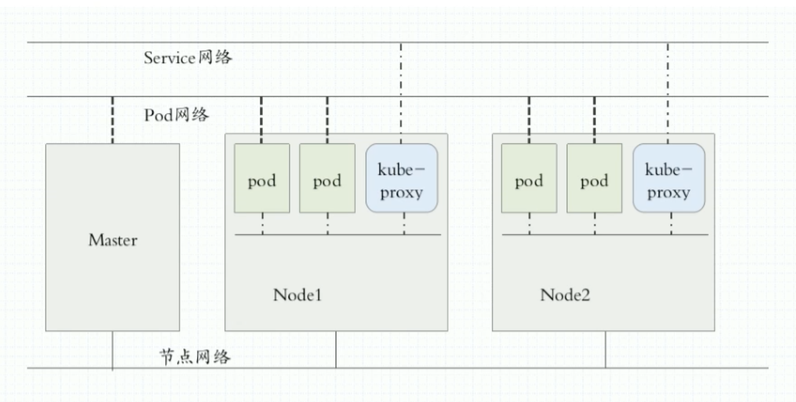

# 扩展与结语


## 1. 集群IP段怎么设置最合适？


### 1.1. IPv4的专用网络地址

IPv4的地址范围是`1.0.0.1——255.255.255.254`，绝大多数的IP地址都是公有地址，需要向国际互联网信息中心申请注册。但是在IPv4地址协议中预留了3个IP地址段，作为专用网络地址，专门供组织机构内部使用。这三个地址段分别位于A、B、C三类地址内：

这三个地址段分别位于A、B、C三类地址内：

A类地址，保留的IP范围是`10.0.0.0 -- 10.255.255.255`
B类地址，保留的IP范围是`172.16.0.0 -- 172.31.255.255`
C类地址，保留的IP范围是`192.168.0.0 -- 192.168.255.255`


当然，IPv4还有其他的保留地址，比如 `127.0.0.0 – 127.255.255.255` 这个IP范围也是保留地址，用于到本地主机的环回地址。


### 1.2. 集群IP的设置规则

我们可以通过下面这张图了解到k8s集群的网络的架构




设置网络地址，应当要满足尽量满足两个要求：一是地址有意义，而是要让人容易理解。根据IPv4的相关规则以及实际的需求，我们可以集群可以遵循以下的IP地址，但这只是我个人的建议：

- 节点网络：节点网络是宿主机的网络，可以使用 `10.0.0.0/8 (255.0.0.0)`网络段
- Pod网络：每个节点可以运行多个Pod，可以使用`172.16.0.0/12 (255.240.0.0)`网络段
- Service：Pod网络和Service网络通过kube-proxy相连，Service网络是虚拟的，可以使用 `192.168.0.0/16 (255.255.0.0)` 网络段


在节点网络中，第一位数字：10，通常标识IDC(互联网数据中心，Internet Data Center) 机房；第二位通常代表机房序号；第三位代表不同的项目或者环境，可以做物理隔离；第四位代表具体的项目。


如果我们使用了以上面的规则，通过IP段让我们能快速地辨识所属网络类型（节点网络、Pod网络、Service网络），同时也便于理解。


## 2. 使用vagrant创建虚拟环境

在本系列的教程中，我们使用multipass搭建k8s的基础环境，我们还可以使用**vagrant**虚拟机管理工具来搭建k8s的基础环境。你可以参考下文中的配置，部署一个符合k8s的要求的虚拟环境。


### 2.1. 创建配置文件

定义`Vagrantfile`，添加如下内容

```shell
Vagrant.configure("2") do |config|
  config.vm.box = "ubuntu/focal64"
  config.disksize.size = '10GB'
  # master1
  config.vm.define "master1" do |master1|
    master1.vm.network "public_network", ip: "192.168.33.10"
    master1.vm.hostname = "master1"
    # 将宿主机../data目录挂载到虚拟机/vagrant_dev目录
    master1.vm.synced_folder "../data", "/vagrant_data"
    # 指定核心数和内存
    config.vm.provider "virtualbox" do |v|
      v.memory = 2048
      v.cpus = 2
    end
  end
  # worker1
  config.vm.define "worker1" do |worker1|
    worker1.vm.network "public_network", ip: "192.168.33.11"
    worker1.vm.hostname = "worker1"
    # 将宿主机../data目录挂载到虚拟机/vagrant_pro目录
    worker1.vm.synced_folder "../data", "/vagrant_data"
    # 指定核心数和内存
    config.vm.provider "virtualbox" do |v|
      v.memory = 2048
      v.cpus = 2
    end
  end
  # worker2
  config.vm.define "worker2" do |worker2|
    worker2.vm.network "public_network", ip: "192.168.33.12"
    worker2.vm.hostname = "worker2"
    # 将宿主机../data目录挂载到虚拟机/vagrant_pro目录
    worker2.vm.synced_folder "../data", "/vagrant_data"
    # 指定核心数和内存
    config.vm.provider "virtualbox" do |v|
      v.memory = 2048
      v.cpus = 2
    end
  end
end
```


### 2.2. 启动虚拟机

启动虚拟机的命令如下

```shell
vagrant up
```


使用`vagrant status`命令查看当前虚拟机的状态，可以看到如下内容

```shell
pan@pan-PC ~/Work/vagrant/kubernetes$ vagrant status                                                                                                          
Current machine states:

master1                   running (virtualbox)
worker1                   running (virtualbox)
worker2                   running (virtualbox)

This environment represents multiple VMs. The VMs are all listed
above with their current state. For more information about a specific
VM, run `vagrant status NAME`.
```


### 2.3. 进入虚拟机

通过以下指令进入虚拟机中
```shell
# 进入master1主机
vagrant ssh master1
```

虚拟机正常启动之后，就可以安装k8s集群了！


## 3. 结语


至此，k8s的基础知识就介绍这里，后续我将有继续产出k8s相关的深入知识，欢迎持续关注！

- 作者微信订阅号：极客开发者up

- 作者博客：[https://blog.jkdev.cn](https://blog.jkdev.cn)

