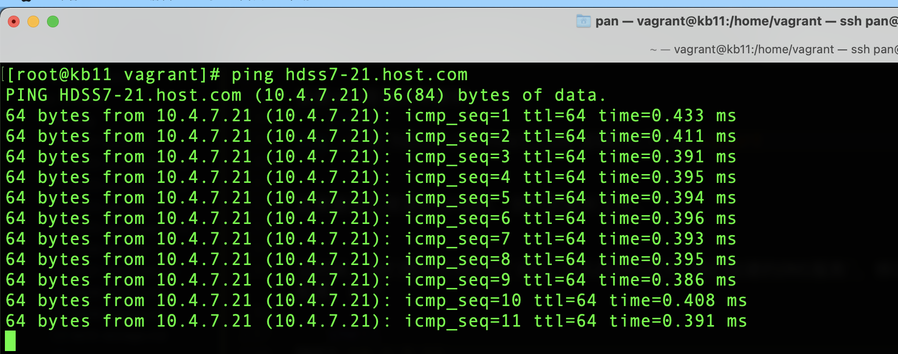

# k8s二进制安装环境准备

在进行集群学习之前，我们先准备虚拟机环境，我们使用 `vagran` 来管理虚拟机，如果你电脑上还没有 vagrant 虚拟机管理工具，可以参考这篇文章[https://blog.jkdev.cn/index.php/archives/335/](https://blog.jkdev.cn/index.php/archives/335/)


## 1. 启动虚拟机 

在一个工作目录中创建 `Vagrantfile` 文件，添加以下内容

```ruby
Vagrant.configure("2") do |config|
  config.vm.box = "centos/7"
  # kb11
  config.vm.define "kb11" do |kb11|
    kb11.vm.network "public_network", ip: "192.168.14.11"
    kb11.vm.hostname = "kb11"
    # 指定核心数和内存
    config.vm.provider "virtualbox" do |v|
      v.memory = 2048
      v.cpus = 2
    end
  end
  # kb12
  config.vm.define "kb12" do |kb12|
    kb12.vm.network "public_network", ip: "192.168.14.12"
    kb12.vm.hostname = "kb12"
    # 指定核心数和内存
    config.vm.provider "virtualbox" do |v|
      v.memory = 2048
      v.cpus = 2
    end
  end
  # kb21
  config.vm.define "kb21" do |kb21|
    kb21.vm.network "public_network", ip: "192.168.14.21"
    kb21.vm.hostname = "kb21"
    # 指定核心数和内存
    config.vm.provider "virtualbox" do |v|
      v.memory = 2048
      v.cpus = 2
    end
  end
  # kb22
  config.vm.define "kb22" do |kb22|
    kb22.vm.network "public_network", ip: "192.168.14.22"
    kb22.vm.hostname = "kb22"
    # 指定核心数和内存
    config.vm.provider "virtualbox" do |v|
      v.memory = 2048
      v.cpus = 2
    end
  end
  # kb200
  config.vm.define "kb200" do |kb200|
    kb200.vm.network "public_network", ip: "192.168.14.200"
    kb200.vm.hostname = "kb200"
    # 指定核心数和内存
    config.vm.provider "virtualbox" do |v|
      v.memory = 2048
      v.cpus = 2
    end
  end
end
```


以上的配置文件，我们指定了 `centos 7` 作为所有虚拟机的基础镜像，并且分别定义了 5 台虚拟机，使用以下命令启动虚拟机

```shell
# 启动虚拟机
vagran up
```

启动虚拟机之后进入虚拟机，修改 root 用户密码，在接下来的集群搭建操作中，我们都将在 root 用户下进行。以 kb11 为例，操作指令如下：

```shell
# 进入 kb11 虚拟机
vagrant ssh kb11
# 修改root账号密码
sudo passwd root
# 切换到 root 用户
su
```

## 2. 初始化

初始化工作在所有的主机上执行

安装epel源

```shell
yum install -y epel-release
```


安装常用的工具
```shell
yum install -y vim wget net-tools telnet tree nmap sysstat lrzaz doc2unix bind-utils
```

关闭selinx和防火墙
```shell
# 关闭selinx
setenforce 0
# 关闭防火墙
systemctl stop firewalld
```

以上指令只是临时关闭selinux，永久关闭selinux，需要把`/etc/selinux/config`里面的`SELINUX`值修改为`disabled`，如下

```shell
SELINUX=disabled
```

## 3. 初始化域名解析服务器


### 3.1. 安装域名解析服务器软件

我们把 `kb11` 这台主机作为域名服务器。接下来进行初始化操作。

安装bind9软件

```shell
yum install -y bind
```

安装好bind之后，修改bind的配置文件`/etc/named.conf`，修改的配置参数如下
```shell
# 修改服务的IP
listen-on port 53 { 192.168.14.11; };
# 允许任意主机使用解析服务
allow-query     { any; };
# 添加 forwarders 键， 值：网关地址
forwarders      { 192.168.14.254; };
# 开启dns转发
allow-query-cache       { any; };
# 使用递归的方式
recursion yes;
#关闭sec
dnssec-enable no;
dnssec-validation no;
```

### 3.2. 配置域名解析

在这里，我们不赘述域名解析以及相关软件的相关知识，如果你在阅读本文有困难时，建议先去了解 **dsn服务器** 以及 **bind9软件** 的相关知识。我们对集群中的相关主机设置相关的域名解析，以便能通过域名访问到我们对应的服务器。以下是具体操作过程：


修改区域配置文件 `/etc/named.rfc1912.zones`，覆盖默认内容如下：
```shell
zone "host.com" IN {
	type master;
	file "host.com.zone";
	allow-update { 192.168.14.1; };
};

zone "od.com" IN {
	type master;
	file "od.com.zone";
	allow-update { 192.168.14.1; };
};
```

编辑区域数据文件`/var/named/host.com.zone`，改为如下内容

```shell
$ORIGIN host.com.
$TTL 600 ; 10 minutes
@ IN SOA dns.host.com. dnsadmin.host.com. (
    2022012001 ; serial
    10800      ; refresh (3 hours)
    900        ; retry (15 minutes)
    604800     ; expire (1 week)
    86400      ; minium (1 day)
    )
    NS dns.host.com.

$TTL 60    ;   1 minute
dns           A      192.168.14.11
HDSS7-11      A      192.168.14.11
HDSS7-12      A      192.168.14.12
HDSS7-21      A      192.168.14.21
HDSS7-22      A      192.168.14.22
HDSS7-200     A      192.168.14.200
```


编辑区域数据文件`/var/named/od.com.zone`，改为如下内容

```shell
$ORIGIN od.com.
$TTL 600 ; 10 minutes
@ IN SOA dns.od.com. dnsadmin.od.com. (
    2022012002 ; serial
    10800      ; refresh (3 hours)
    900        ; retry (15 minutes)
    604800     ; expire (1 week)
    86400      ; minium (1 day)
    ) 
    NS dns.od.com.

$TTL 60    ;   1 minute
dns    A   192.168.14.11
```

启动dns服务

```shell
# 启动dns 服务
systemctl start named
# 将dns 服务设置为开机自启
systemctl enable named
```


验证dns是否正常

```shell
# 查询53端口服务
netstat -luntp | grep 53
```

可以看到53端口服务正常运行，如下图所示


查看dns是否正常解析
```shell
dig -t A hdss7-21.host.com @192.168.14.11 +short
```

如果看到正常返回IP地址，则代表解析正常。


这时候，我们需要把我们的`kb1`主机的DNS改为`我们自建的DNS服务`，修改 `/etc/sysconfig/network-scripts/ifcfg-eth1` 文件为的 DNS1 配置，如下

```shell
# 设置网卡的网关
GATEWAY=192.168.14.254
# 设置网卡的dns
DNS1=192.168.14.11
```

再重启服务
```shell
systemctl restart network
```

> 实际上，重启网络之后，我们配置的网卡会生效，但是在 vagrant 虚拟机里，默认有一个 DNS 解析。此时 `/etc/resolv.conf` 文件内容如下

```shell
```

在 vagrant 里，vagrant 默认使用一个 vagrant 的 dns，那么我们自己设置的dns便成了备用dns，为了达到我们域名解析的效果，我们执行下面“4”的步骤！


## 4. 修改所有的主机的域名解析服务器

将系统中配置文件`/etc/resolv.conf`，改为如下内容

```shell
# 查询主机域
search host.com
# 解析服务器
nameserver 192.168.14.11
```

需要注意的是，本文演示的环境是 `vagrant` 里的 `centos 7`，如果我们重启虚拟机，`/etc/resolv.conf` 文件将被重置，将域名解析重置为 `vagrant` 工具本身默认的 DNS ！为了保证我们修改的配置在学习期间有效，你可以使用下列推荐的方式对虚拟机进行重启！

```shell
# 保存虚拟机镜像
vagrant suspend
# 恢复虚拟机镜像
vagrant resume
```

> 建议：如果我们在个人电脑使用 vagrant ，在电脑关机之前，我们可以使用 `vagrant suspend` 保存虚拟机的快照，在电脑开机之后，使用 `vagrant resume` 恢复上次保存的快照。这个我们就可以在 vagrant 虚拟机里，继续执行上次未完成的任务。


我们再使用如下指令检测是否解析正常
```shell
ping hdss7-21.host.com
# 因为设置了 search ，也可以直接ping 短域名
ping hdss7-21
```

如果返回如下图内容，这代表dns正常解析




我们在 `/etc/resolv.conf` 文件中修改只是让主机临时生效，如果重启之后，系统将会根据网卡配置来指定对应的 域名解析服务器，所以永久生效的方式应当是 修改网卡 配置中的DNS域名。


> 注意：`/etc/resolv.conf` 设置域名解析时，主机域名（专门用于访问主机的域名）可以使用 `search` 标注查询的主机域，但注意 业务域名（用于部署项目的域名）不要使用这个配置。


